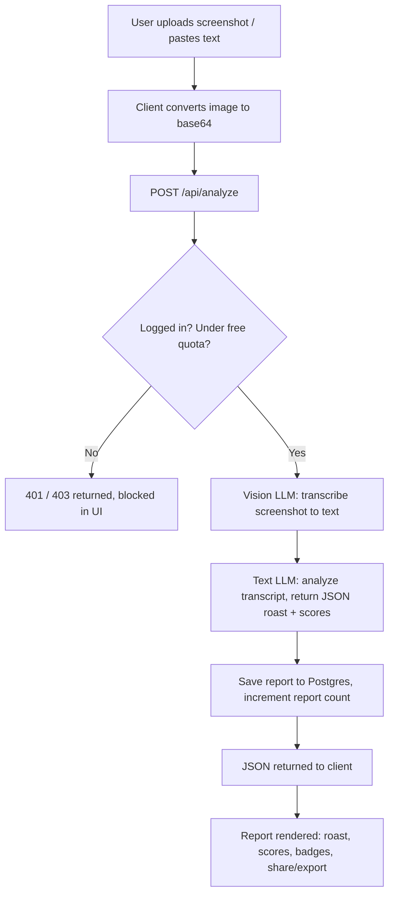

# Roast My Chat — Project Overview

## 1. What This App Is

A web app that turns a chat screenshot (or pasted text) into a shareable, AI-generated "roast report" — a witty roast plus scored metrics (dry-texting score, flirting meter, ghosting risk, chaos level, etc.), badges, meme captions, and suggested replies. Users sign up, get a limited number of free reports, and can revisit past reports from a dashboard.

## 2. What Happens When You Use It (Request Flow)

Step by step:

1. **Upload** — user drops screenshots or pastes text in the browser.
2. **Auth + quota check** — the API route confirms the user is signed in and hasn't exceeded their free-report limit (checked in the database, not just the UI).
3. **OCR via vision model** — each screenshot is sent to a vision-capable LLM that transcribes the conversation exactly as it appears (who said what, emojis, timestamps).
4. **Analysis via text model** — the transcript goes to a second LLM with a prompt demanding a strict JSON schema back: roast text, all scores, flags, badges, captions, replies.
5. **Persist** — the parsed JSON is saved as a row in `reports`, tied to the user, and their `reports_count` is incremented.
6. **Render** — the client displays the report and offers share/download.

## 3. Tech Stack — What, Why Here, and What Else Was Considered

### Application Layer

| Technology | What It Does | Why Used In This App | Alternatives Considered | Why This One Won |
|---|---|---|---|---|
| **Next.js (App Router)** | React framework with file-based routing, server rendering, and built-in API route handlers | Powers every page (`/`, `/analyze`, `/dashboard`, `/pricing`) *and* the backend (`/api/analyze`, `/api/auth/callback`) in one codebase | Vite + React with a separate Express/Fastify backend; Remix; plain CRA | Didn't want to run and deploy two separate services for a solo project — Next.js gives frontend + backend + routing in one framework, one deploy target |
| **TypeScript** | Adds static types on top of JavaScript | Every AI response has to match a strict schema (scores, flags, badges) before reaching the UI — types catch shape mismatches before runtime | Plain JavaScript | The AI-response shape is exactly the kind of thing that silently breaks in plain JS; types make that class of bug show up at compile time |
| **Tailwind CSS** | Utility-first CSS, styles written as classes in markup | Built the entire custom dark/glassmorphism design (glass cards, gradients, glow effects) directly in JSX | Plain CSS/SCSS modules; component libraries (MUI, Chakra UI) | Component libraries fight you when the design is fully custom; hand-written CSS is slower to iterate. Tailwind gave full visual control with fast iteration |
| **Framer Motion** | Declarative animation library for React | Fade/slide-in on load, and scroll-triggered reveals (`whileInView`) for sections like "How It Works" | CSS transitions/keyframes; GSAP | CSS alone can't easily do "animate only when scrolled into view"; GSAP is more powerful but is imperative and heavier for this scale of animation |
| **Zustand** | Minimal global state store for React | Holds the signed-in user, upload queue, and current AI result so any component (Navbar, Analyze page, Dashboard) can read/update them | Redux/Redux Toolkit; React Context API | Redux is a lot of boilerplate for a handful of state slices; plain Context re-renders every consumer on any change. Zustand gave global state with neither cost |

### Backend / Data Layer

| Technology | What It Does | Why Used In This App | Alternatives Considered | Why This One Won |
|---|---|---|---|---|
| **Supabase (Postgres + Auth)** | Hosted Postgres database plus built-in authentication (email/password, session cookies) | Stores `profiles`, `reports`, `subscriptions`; handles signup/login/session for every page | Firebase (NoSQL); self-hosted Postgres + custom auth (NextAuth/Auth0) | Report data (scores, flags, relations to a user) is inherently relational — Postgres fits better than Firebase's NoSQL model. Supabase also bundles auth + database as one service, so there's no separate auth provider to wire up |
| **Row-Level Security (Postgres policies)** | Database-enforced access rules, e.g. "a user can only read their own rows" | Every table (`profiles`, `reports`, `subscriptions`) has RLS policies so even a direct API call can't leak another user's data | Enforcing "only see your own data" purely in application code | App-layer checks can be forgotten in some code path; RLS makes the database itself refuse the query, regardless of which code path reaches it |
| **Postgres functions** (`can_analyze`, `increment_report_count`) | Stored procedures that run inside the database | Enforce the free-report quota and increment counts atomically | Checking/incrementing the quota in the Next.js API route with plain JS | Doing it in the database means the check can't be bypassed by hitting the API a different way, and avoids race conditions from concurrent requests |

### AI Layer

| Technology | What It Does | Why Used In This App | Alternatives Considered | Why This One Won |
|---|---|---|---|---|
| **OpenRouter** | A single API that routes requests to many different LLM providers/models | Both the vision (OCR) call and the text (roast/analysis) call go through it | Integrating OpenAI, Anthropic, and Google's APIs separately; committing to one provider only | One API key and one request format to reach many models — makes it trivial to swap models or add fallbacks without rewriting provider-specific integration code. Free-tier models also meant zero inference cost during development |
| **Multi-model fallback + retry** (custom logic in `ai.ts`) | Tries a short ordered list of models, retrying once on rate-limit before moving to the next | Free-tier models get rate-limited by their upstream providers fairly often and unpredictably | Hardcoding a single model and letting the request fail | A single free model becoming unavailable would mean the whole feature goes down; trying several in sequence makes the app resilient to any one provider being congested |

### Supporting Libraries

| Technology | What It Does | Why Used In This App | Alternatives Considered | Why This One Won |
|---|---|---|---|---|
| **react-dropzone** | Drag-and-drop file input with validation | Screenshot upload zone on the Analyze page (type/size validation included) | Building a custom `<input type="file">` drag handler | Drag events, validation, and accessibility are already solved correctly — no reason to rebuild it |
| **react-hot-toast** | Small toast notification library | Success/error feedback (e.g. "Your chat has been roasted!", quota-exceeded errors) | Building a custom toast component; react-toastify | Minimal API, good default styling, easy to theme to match the dark UI |
| **html-to-image + jsPDF** | Convert a DOM node to an image / build a PDF, both in the browser | "Download as image/PDF" on a finished report | Server-side rendering to an image (e.g. a headless-browser screenshot service) | Runs entirely client-side — no extra backend infrastructure or cost just to export a report |
| **lucide-react** | Icon component library | Every icon in the UI (navbar, buttons, feature cards) | react-icons; Font Awesome | Tree-shakeable (only the icons actually used are bundled) and visually consistent with the rest of the design |
| **ESLint (eslint-config-next)** | Static code analysis / linting | Runs across the whole codebase | No linting; a hand-rolled ESLint config | Next.js's config catches framework-specific mistakes (like using `` instead of `next/image`) that a generic linter wouldn't know to flag |

## 4. Data Model

| Table | Purpose | Key Columns |
|---|---|---|
| `profiles` | Extends Supabase's `auth.users` with app-specific fields; auto-created on signup via a Postgres trigger | `reports_count`, `is_premium`, `premium_since` |
| `reports` | One row per generated roast | `user_id` (owner), `result` (full AI output as JSONB), `platform`, `chat_partner` |
| `subscriptions` | Scaffold for premium billing | `stripe_subscription_id`, `status` (Stripe checkout not yet wired up) |

## 5. Disclaimer

Built for entertainment only. Not affiliated with WhatsApp, Instagram, Telegram, or Messenger.
